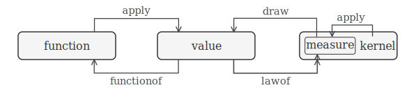

## <a id="sec:design"></a>Language design

This section details the semantics of FlatPPL's core constructs: namespaces, inputs, variates, measures and stochastic graphs, application and reification,
an inference-agnostic design, calling conventions, broadcasting, and modules.

### <a id="sec:namespaces"></a>Names and namespaces

Each FlatPPL code file, or embedded code block, represents a FlatPPL module.
All variable bindings in a FlatPPL module share a single flat namespace, so all variable names must be unique across the module. Variables may be bound to any FlatPPL object type. This matches both HS³ (object names must be unique across a document) and RooFit (all `RooAbsArg` object names must be unique across a RooFit workspace). For multi-file FlatPPL models, `load(filename)` provides namespace isolation. See section [Modules](#sec:modules) for details.

Record field names and table column names are local to their object and not
part of the global namespace, nor are the argument names of functions
and kernels.

### <a id="sec:calling-convention"></a>Calling conventions

All callables — built-in functions, user-defined functions, and built-in or user-defined
measure and kernel constructors — accept exactly these calling forms:

```flatppl
f(x, y)                       # positional — only if argument order is defined
f(a = x, b = y)               # keyword
f(record(a = x, b = y))       # shallow auto-splatting
```

**Rules:**

- `f(x, y)` (positional) is allowed **only** when the callable has an explicit argument
  order. No mixing of positional and keyword arguments in a single call. (Language
  constructs like `functionof`, `lawof`, and `broadcast` have a distinguished first
  operand followed by optional keyword bindings — see below.)
- **Built-in functions** (`exp`, `log`, `cat`, `ifelse`, `polynomial`, ...) have a defined
  argument order.
- **Built-in measure and kernel constructors** (`Normal`, `Poisson`, ...) do **not** have
  a positional calling convention. They must be called with keyword arguments or a record.
- **User-defined callables** from `functionof` / `lawof` support positional calling only
  when an explicit interface declaration has been provided. Otherwise they are
  keyword-only.
- **Special forms** such as `draw(...)` and `elementof(...)` are not ordinary callables
  and follow their own construct-specific rules.

**Shallow auto-splatting:** When a record is passed to a callable that expects individual
named arguments, the record's top-level fields are matched by name to the callable's
parameters. This matching is shallow and exact, and the order of the record fields is
irrelevant. A record whose fields do not match the callable's interface is a static error.

### <a id="sec:variate-measure"></a>Variates and measures

FlatPPL distinguishes **variates** from **measures** and **kernels**.
A variate represents a specific value — one realization in any given evaluation
of the model. A measure or kernel, by contrast, represents the entire distribution
over possible values. More formally, measures are monadic while variates are not.

A binding of the form `c = f(a, b)` introduces a **deterministic node** in the computational DAG.
A binding of the form `x = draw(Normal(mu = c, sigma = s))` introduces a **stochastic node**.
In generative mode, a stochastic node yields a sampled value; in scoring mode,
it contributes a density term that is either evaluated (if observed) or marginalized out
(if latent).

FlatPPL intentionally supports two equivalent mechanisms to express stochastic computations:

1. **Stochastic-node notation** expresses models as a mix of deterministic computations
   and `draw` statements, reading like a generative recipe.
2. **Measure-composition notation** writes models as a mix of deterministic computations
   and measure algebra, using `weighted`, `joint`, `jointchain`, `chain`, `pushfwd`, and
   related operations to combine and transform measures.

Both can be used together in a FlatPPL module, but they map to different types of
probabilistic coding systems.
Stochastic-node notation mirrors probabilistic programming languages like Stan and Pyro,
while measure composition mirrors the HS³ and RooFit approach. By supporting both approaches,
FlatPPL can be emitted from both types of systems. Term-rewriting within FlatPPL can raise
and lower code to match either of them. This strengthens the potential role of FlatPPL as
a cross-system intermediate representation (IR).

### Module inputs

FlatPPL modules declare their external inputs by binding variables to `elementof(...)`:

```flatppl
mu = elementof(reals)
sigma = elementof(interval(0.0, inf))

x = draw(Normal(mu = mu, sigma = sigma))
y = 2 * x
```

Here `mu` and `sigma` are module inputs. The special form `elementof(S)` declares that their values are restricted to the given sets. To evaluate a subgraph of a module, whether in generative or scoring mode, the application must supply concrete values for all inputs that are part of the subgraph.

The role of module inputs — as fit parameters, hyperparameters, or fixed constants — is determined by
how the FlatPPL module is used by an application, not by the module itself.

### Application and reification

FlatPPL provides operations that turn subgraphs into first-class objects and
vice versa.



A function represents a reified deterministic DAG, either implicit
(built-in) or explicitly constructed.
Ordinary function application `y = f(a, b, ...)` introduces a deterministic
node `y` into the graph. `functionof(y)` goes in the opposite direction:
it reifies the ancestor subgraph of a given value `y` as a first-class function.

Conversely, a probability measure represents a reified stochastic DAG, either an implicit (built-in) or explicit one.
`x = draw(m)` introduces a stochastic node `x` from a probability measure `m`.
In the other direction, `m = lawof(x)` reifies the ancestor subgraph of a given value `x`
as a probability measure or Markov kernel, depending on whether there are free inputs.

By default, `lawof` and `functionof` trace the full ancestor subgraph back
to the module inputs. They can be called with additional keyword-arguments
to designate and label boundary nodes, stopping the trace there, so that
these nodes become the inputs of the kernel or function under their new names.

#### <a id="sec:functionof"></a>Deterministic functions and `functionof`

Consider a simple deterministic computation:

```flatppl
c = a + b
d = a - b
e = c * d
```

Here `e` is a specific value during any given evaluation of the code.
But the computation that produces `e` from `a` and `b` is useful in its own right:
we might want to apply it elementwise over arrays, or use it as a transformation in `pushfwd`.
The name `e` refers to a value, not to the computation that produced it,
so we need a way to extract the computation as a first-class function:

```flatppl
f = functionof(e)                   # f: {a, b: Real} → Real
C = broadcast(f, a = A, b = B)      # apply f elementwise over arrays A, B
```

`functionof(e)` captures the entire computation leading to `e` — the sub-DAG that contains
`e` and all its ancestors — as a reusable function object.
The sub-DAG must be fully deterministic and so must not contain any `draw` nodes.

The argument names of the resulting function are the names of the free variables of the sub-DAG,
but decoupled from those variables. As the graph nodes are
not ordered, the function only supports keyword arguments, not positional arguments.

Nullary calls (`f()`, `K()`) are not part of the surface syntax — a binding with no
free inputs is a value or a measure, not a callable.

The output type of the reified function matches the type of the argument of `functionof`:

```flatppl
f = functionof(e)                                    # scalar output
f = functionof(record(x = something, y = other))     # record output
f = functionof([something, other])                    # array output
```

**Subgraph reification.** Sometimes only part of the ancestor sub-DAG should be reified. In our example, `e`
depends on `c` and `d`, which in turn depend on `a` and `b`. If we want the function
represented by the subgraph that starts at `a` and `d` — ignoring how `d` was computed
from `a` and `b` — we can set *boundary inputs* that stop the ancestor backtrace early:

```flatppl
g = functionof(e, p = a, q = d)     # g: {p, q: Real} → Real
M2 = pushfwd(g, some_measure)       # transform a measure over (p, q)
```

The keyword arguments `p = a, q = d` declare that the trace stops at nodes `a` and `d`,
which become the inputs of `g` under the new names `p` and `q`. The computation from
`a` and `b` to `d` is excluded — `g` only contains the path from `a` and `d` to `e`.

If boundary inputs are specified, the reified function supports positional arguments
in addition to keyword arguments. Either all boundary inputs must be given, or none. This ensures that a boundary input specification, if present, covers all inputs of the function and thereby introduces an explicit argument order.
Technically, a specified boundary node `a` is replaced by a new node, generated via
`elementof(valueset(a))`, in the reified graph.

The function argument names do not have to differ from the boundary node names:

```flatppl
h = functionof(e, a = a, d = d)     # h: {a, d: Real} → Real
```

The resulting function `h` now has arguments named `a` and `d`, but these are local
to the function and decoupled from the original nodes `a` and `d`.

**Identity law.** `functionof(f(a, b), a = a, b = b)` is equivalent to `f`.

#### Kernels, measures and `lawof`

`lawof(x)` is the stochastic counterpart of `functionof`: it reifies the ancestor
sub-DAG of `x` as a **measure** or **kernel**. The same boundary input mechanism and
all-or-nothing rule for specifying boundary nodes apply. The key difference is that
the sub-DAG may be stochastic and so may (but does not have to) contain `draw` nodes.

Consider this Bayesian example:

```flatppl
theta1 = draw(Normal(mu = 0.0, sigma = 1.0))
theta2 = draw(Exponential(rate = 1.0))
a = 5.0 * theta1
b = abs(theta1) * theta2
obs = draw(iid(Normal(mu = a, sigma = b), 10))

joint_model = lawof(record(theta1 = theta1, theta2 = theta2, obs = obs))
prior_predictive = lawof(record(obs = obs))
prior = lawof(record(theta1 = theta1, theta2 = theta2))
forward_kernel = lawof(record(obs = obs), theta1 = theta1, theta2 = theta2)
```

Here we create the following probability measures and kernels:

- `joint_model` is the joint probability distribution over parameters and observation.
  `joint_model` is equivalent to `jointchain(prior, forward_kernel)`.

- `prior_predictive` is the probability distribution of the observation obtained by
  marginalizing over `theta1` and `theta2` — they are internal stochastic nodes in
  the traced sub-DAG, not boundary inputs, so `lawof` integrates them out.
  `prior_predictive` is equivalent to `chain(prior, forward_kernel)`.

- `prior` is the probability distribution of the parameters `theta1` and `theta2`.

- `forward_kernel` is the Markov kernel of the forward model; it maps values for
  `theta1` and `theta2` to probability distributions of the observation.

**Relationship to `functionof`.** On a purely deterministic sub-DAG, `lawof` returns a
Dirac kernel while `functionof` returns the deterministic function itself.

Engines are not required to compute marginals eagerly; they may resolve them lazily or
symbolically when the measure is consumed.

**Identity law.** `lawof(draw(m))` is equivalent to `m`, and
`lawof(draw(k(a, b)), a = a, b = b)` is equivalent to `k`.

### Interface adaptation

FlatPPL provides complementary operations for structural renaming:

- **`rebind`** renames the input parameters of a function, kernel, or likelihood object.
- **`relabel`** renames the elements of values and lifts to sets, functions, measures, and kernels.

At the value level, `relabel` turns an array into a named record:

```flatppl
v = relabel([1.0, 2.0, 3.0], ["x", "y", "z"])
# equivalent to:
v = record(x = 1.0, y = 2.0, z = 3.0)
```

or renames record fields and table columns:

```flatppl
v = relabel(record(a = 1.0, b = 2.0, c = 3.0), ["x", "y", "z"])
# equivalent to:
v = record(x = 1.0, y = 2.0, z = 3.0)
```

The same output-side renaming lifts directly to sets, functions, measures, and kernels:

```flatppl
named_S = relabel(cartpow(reals, 3), ["x", "y", "z"])
named_f = relabel(f, ["x", "y", "z"])
named_M = relabel(M, ["x", "y", "z"])
named_K = relabel(K, ["x", "y", "z"])
```

For functions, `relabel(f, names)` is post-composition with `relabel` on the function
result; for measures it is equivalent to `pushfwd(relabel(_, names), M)`; for kernels it acts pointwise on the output measure.

`rebind` renames the inputs of a function or kernel:

```flatppl
g = rebind(f, p = a, q = b)
K2 = rebind(K, alpha = x, beta = y)
```

`rebind` is partial: unmentioned inputs pass through unchanged. This makes it a convenient
tool for aligning parameter names when combining models from different sources
(see [multi-file models](#sec:modules)).

See [built-in functions](07-functions.md#sec:functions) for full reference documentation
on `relabel` and `rebind`.

### Placeholders and holes

#### Placeholder variables

Creating functions and kernels with boundary inputs via `functionof` and `lawof`
requires the creation of unique global variable names. Placeholder variables are
special variable names of the form `_name_` (leading and trailing underscore)
that are local to a `functionof(...)` and `lawof(...)` and can be thought of
as creating unique global input of `elementof(anything)` implicitly. All
placeholders must appear both in the expression to be reified and the boundary
input keyword arguments.

For example

```flatppl
f = functionof(_a_ * b + _c_, a = _a_, c = _c_)
```

is equivalent to:

```flatppl
_tmp1 = elementof(anything)
_tmp2 = elementof(anything)
f = functionof(_tmp1 * b + _tmp2, a = _tmp1, c = _tmp2)
```

Placeholders are **not** holes (see below). An expression with placeholders like
`_a_ * b + _c_` must *not* appear outside of a `functionof(...)` or `lawof(...)`.

**Scoping rule.** The scope of a placeholder is the nearest enclosing `functionof` or
`lawof`. The same placeholder name may appear in different scopes without conflict:

```flatppl
functionof(functionof(_a_ * b, a = _a_)(some_value) + _a_, a = _a_)
```

A placeholder in an inner `functionof` or `lawof` **must** be bound there, so this code is invalid:

```flatppl
# DISALLOWED:
functionof(functionof(_a_ * b + _c_, a = _a_)(some_value) + _d_, c = _c_, d = _d_)
```

#### Holes

The reserved name `_` denotes a **hole** — a position in a deterministic expression where
an argument is not yet supplied. An expression containing holes is not a value expression;
it denotes an anonymous function whose parameters are the holes, in strict
left-to-right reading order. This is analogous to the $f(\cdot, b)$ notation used in
mathematics to denote a function with a free argument.

Each `_` introduces a distinct positional parameter. Holes do not inherit keyword names
from enclosing call positions. For named parameters, use placeholder variables or
`functionof` with an explicit interface declaration.

Note: Holes are different from placeholders (see above). Placeholders are a convenience
to more easily create functions and kernels via `functionof` and `lawof`. Holes turn
expressions into functions and kernels directly.

A single hole, resulting in a one-argument function:

```flatppl
neg = 0 - _
poly = polynomial(coefficients = cs, x = _)
```

Multiple holes — left-to-right positional order:

```flatppl
g = f(_, b, _)
h = pow(_ / _, 2)
```

Each `_` is distinct: `_ * _` multiplies two different inputs rather than squaring one.
Use placeholders if arguments need to appear in the expression more than once, e.g. `functionof(_x_ * _x_, x = _x_)`.

**Lowering.** An expression with holes lowers to a `functionof` with placeholder
variables. For example

```flatppl
g = f(_, b, _)
```

lowers to something like (naming is an implementation detail and not normative)

```flatppl
g = functionof(f(_arg1_, b, _arg2_), arg1 = _arg1_, arg2 = _arg2_)
```

which in turn lowers to

```flatppl
_tmp1 = elementof(anything)
_tmp2 = elementof(anything)
g = functionof(f(_tmp1, b, _tmp2), arg1 = _tmp1, arg2 = _tmp2)
```

`_` may **not** appear on the left-hand side of a variable binding.

### <a id="sec:broadcast"></a>Broadcasting

`broadcast(f_or_K, name = array, ...)` or `broadcast(f_or_K, array, ...)` maps a function or kernel
elementwise over arrays (and row-wise over tables; see [tables](03-value-types.md#tables)).
Keyword arguments bind inputs by name. If the callable has a declared positional order,
positional binding is also permitted.

Deterministic broadcast with a named function:

```flatppl
b = 2 * a + 1
f = functionof(b, a = a)
C = broadcast(f, a = A)
```

With positional argument binding:

```flatppl
C = broadcast(f, A)
```

Using an anonymous function:

```flatppl
C = broadcast(2 * _ + 1, A)
```

Multi-input broadcast:

```flatppl
d = a * x + b_param
g = functionof(d)
E = broadcast(g, a = slopes, x = points, b_param = intercepts)
```

Stochastic broadcast — kernel over array, producing an array-valued measure:

```flatppl
K = Normal(mu = a, sigma = 0.1)
D = draw(broadcast(K, a = A))
```

**Return type.**

- `broadcast(function, ...)` returns an **array value**.
- `broadcast(kernel, ...)` returns an **array-valued measure**: the independent product
  measure of the kernel applications at each array position.

The stochastic case returns a single product measure, not an array of measures. This respects
the rule that measures are not stored inside arrays or records while still enabling
vectorized stochastic model building.

**Independence is explicit.** Kernel broadcast means independent elementwise lifting. It
does not cover dependent sequential kernels, autoregressive chains, or coupled array
structure. For those, use `jointchain` or `chain` with explicit indexing.

**Shape adaptation.** `broadcast` follows standard broadcasting rules: singleton
dimensions (length 1) are implicitly expanded to match the corresponding dimension of
the other arguments. Scalar arguments are treated as arrays with all-singleton shape.
Non-singleton dimensions must match across all arguments.

### <a id="sec:modules"></a>Multi-file models

Each FlatPPL file is a **module**: a flat namespace of named bindings. This corresponds
directly to a RooFit workspace and to an HS³ document. When FlatPPL code is embedded in
Julia or Python via macros or decorators, each embedded block is a separate module.

**`load("path/to/file.flatppl")`** loads a FlatPPL file and returns a module reference.
Members are accessed via dot syntax:

```flatppl
sig = load("signal_channel.flatppl")
bkg = load("background_channel.flatppl")

sig_model = sig.model
bkg_model = bkg.model
```

**Load-time substitution.** `load` may also be called with keyword arguments to substitute
explicit input nodes of the loaded module:

```flatppl
sig = load("signal_channel.flatppl", mu = signal_strength, theta = nuisance)
```

The left-hand side of these bindings must refer to an input of the loaded module, while
the right-hand side may be any value node in the loading module. The value set of
both must be compatible, so the the computational structure of the loaded module
is not modified.

**Path resolution.** Relative paths in `load(...)` are resolved relative to the directory
of the FlatPPL file containing that `load(...)` call, not the host process's working
directory. This keeps model directories relocatable. The forward slash `/` is the
mandatory path separator on all platforms. Parent-directory traversal via `..` is allowed.
Absolute paths are permitted but discouraged, as they prevent relocatable model
repositories and may be rejected by archival tools.

**Aliasing** is just assignment: `sig_model = sig.model` creates a local alias — a
reference to the same underlying object in the loaded module's DAG, not a clone.

**Model composition.** The module system provides namespace isolation through `load`,
while `rebind` aligns mismatched parameter interfaces and `joint_likelihood` combines
channels. Modules intended for composition should therefore export kernels with declared
interfaces where appropriate. Richer conventions for large-scale combined analyses may be
refined in future versions.
