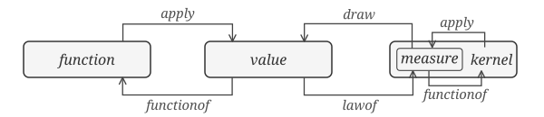

## <a id="sec:design"></a>Language design

This section details the semantics of FlatPPL's core constructs: modules, objects,
and callables, and built upon them variates, measures, deterministic and stochastic
graphs, and more.

### <a id="sec:namespaces"></a>Objects, expressions, names and modules

The FlatPPL language consists of **objects** (**measures**, **likelihood objects**,
**tuples**, or **values** like numbers, arrays, records and tables). Objects include
**callables** (value functions, constructors, transition kernels and special
operations) that operate on objects.

Ordinary **callables** have named inputs and a single output; that output may be a
tuple bundling multiple components (see [Tuples](#sec:tuples)). Special operations
are callables that handle inputs in a different way and typically provide higher-level
semantics. The output of any callable depends deterministically on its inputs and calls
may not have any side effects. No callables may have nullary inputs, as this would
make them equivalent to known values.

Numerical precision (e.g., 32-bit vs. 64-bit floating point) is not specified by
FlatPPL; the choice is left to implementations and their users.

A FlatPPL **module** is an unordered set of bindings of names to expressions. Expressions
are single or nested calls that bind expressions (literal or by name reference)
to inputs of callables.

FlatPPL is loop-free and has no block structure, so a module is implicitly a directed
acyclic graph (**DAG**), which may not be fully connected. The nodes in that graph are
the named and unnamed (results of) calls, the edges are the connections between
outputs and inputs of calls.

The graphs of several modules can be combined, see [Module composition](#sec:modules)
below for details.

Note: Record field names and table column names are local to their object and not
part of the global module namespace, nor are the argument names of functions
and kernels.

### <a id="sec:binding-names"></a>Binding names

**Public bindings.** Names that do not begin with an underscore are public: they
form the interface of a FlatPPL module. They must match the regular expression
`^[A-Za-z][A-Za-z0-9_]*$`.

**Private bindings.** Binding names that begin with a single underscore and do not
end with an underscore (regular expression
`^_[A-Za-z]([A-Za-z0-9_]*[A-Za-z0-9])?$`), e.g. `_tmp`, are private to a module.
They are not part of the module's public interface and may be eliminated, inlined,
renamed, or otherwise not preserved by tooling such as term-rewriting or dead-code
elimination.

The bare underscore `_` is itself a valid binding name. Each occurrence of `_` on the left-hand side (standalone or inside a decomposition, e.g. `value, _ = rand(rstate, m)`)
lowers to a distinct auto-generated private name. So `_` may be used to discard
values.

**Auto-generated names.** Names starting with a double underscore (regular
expression `^__[A-Za-z0-9][A-Za-z0-9_]*$`) are reserved for automatically generated
module-level binding names. Like other underscore-prefixed names they are
private and elidable. Auto-generated binding names with a purely numerical
ID are denoted in hexadecimal form with a `__0x` prefix in the canonical
FlatPPL and FlatPIR syntax (regular expression `^__0x[0-9a-f]+$`), but may be
encoded differently in other representations of the language.

**Placeholder names.** Names starting and ending with a single underscore (regular
expression `^_[A-Za-z]([A-Za-z0-9_]*[A-Za-z0-9])?_$`) are reserved for placeholder
variables inside `functionof` and `kernelof` (see
[placeholders and holes](#placeholders-and-holes)). They must not be used for
module-level bindings.

**Name resolution.** FlatPPL has two predefined modules: `self` refers to the
current module, and `base` is a predefined module containing FlatPPL's built-ins.
`self.foo` always refers to a current-module binding; `base.foo` always refers to
a built-in. `self` and `base` themselves are reserved names and cannot be bound
to something else.

An unqualified name (no `self.` or `base.` prefix) resolves as follows:

1. If the name is bound in the current module, it resolves to that binding.
2. Otherwise, it resolves to the FlatPPL built-in of that name.

Unresolvable names are static errors.

This makes built-in names shadowable: a module may bind any name except for
`self` and `base`. Adding new built-ins to FlatPPL is therefore a non-breaking
change.

### <a id="sec:calling-convention"></a>Calling conventions

Nullary calls (`f()`) are not allowed.

All ordinary callables — built-in or user defined value functions, constructors or
transition kernels —  accept arguments in two or three forms (denoted here in the
canonical syntax):

- **Keyword arguments** (named arguments): `f(a = x, b = y, ...)`. Arguments are bound
  to inputs by name, the order of the arguments is not relevant.

- **Auto-splatting** (of records and table columns): `f(record(a = x, b = y, ...))` and
  `f(table(a = x, b = y, ...))` are equivalent to `f(a = x, b = y, ...)`. The order of
  fields or columns is not relevant. A call with field or column names that do not match
  the callable's argument names is a static error. Auto-splatting is shallow and occurs only
  when a record or table is the call's sole argument (whatever its field count, a single field
  included); a record given alongside other arguments, or bound to a parameter by keyword, is an
  ordinary value and is not splatted. A sole positional record or table therefore always splats:
  whether its field or column names match the callable's argument names decides only whether the
  call is valid, never whether the splat occurs. A callable with exactly one input whose
  documented domain admits records or tables is exempt and receives a sole positional record or
  table whole, so `sum(t)` reduces over the table rather than splatting. User-defined callables
  are never exempt. Passing a record or table as one ordinary argument requires the keyword
  spelling, as in `f(pars = record(...))`. Auto-splatting is a rule of the ordinary calling
  convention; no special operation splats a sole record or table argument. `table(r)` and
  `record(t)` perform the record–table conversions of [tables](03-value-types.md#tables)
  directly, as dedicated conversions rather than as an instance of auto-splatting.

- **Positional arguments**: `f(x, y, ...)`. Positional arguments are accepted only if
  the callable has ordered inputs, so that the arguments can be mapped to the inputs in order.

All built-in ordinary callables have a defined input order and accept both positional and
keyword arguments.

Special operations have zero to three distinguished, unnamed, ordered inputs of fixed arity.
They may have additional variadic named or unnamed inputs, the order of which may
or may not be significant. The total number of inputs is never zero:

- `elementof`, `external`, `draw`: One distinguished input.
- `vector`: Unnamed variadic inputs with significant order.
- `tuple`: Unnamed variadic inputs with significant order (minimum two).
- `record` and `table`: Named variadic inputs with significant order.
- `functionof` and `kernelof`: One distinguished input, plus optional variadic
  named inputs with significant order.
- `lawof`, `fixed`: One distinguished input.
- `broadcast`: One distinguished input for the function to be broadcast, plus
  named or unnamed inputs that match the inputs of that function.
- `broadcasted`: One distinguished input.
- `cat`, `fchain`, `kchain`: Variadic unnamed inputs with significant order.
- `cartprod`, `joint`, `jointchain`: Variadic unnamed or named inputs with
  significant order.
- `get`: One distinguished input plus variadic unnamed input with
  significant order.
- `superpose`: Variadic unnamed inputs with no significant order.
- `load_module`: One distinguished input plus optional variadic named inputs with
  no significant order.
- `standard_module`: Two distinguished inputs.
- `aggregate`, `metricsum`, `markovchain`, `kscan`: Three distinguished inputs.
- `ksuperpose`: Two distinguished inputs (the kernel and the weight vector); the
  resulting kernel is applied separately to the parameter family.
- `load_data`: One distinguished input plus optional variadic named inputs with
  significant order.
- `checked`: Named parameters `value` and `condition`, per [§07](07-functions.md#checked);
  the canonical calling form is keyword-based.

A distinguished input has no name and so cannot be passed by keyword. The
[measure combinators](06-measure-algebra.md#sec:measure-algebra) likewise take their
inputs positionally: a keyword spelling such as `normalize(M = mu)` is a static error.

### <a id="sec:tuples"></a>Tuples

Some operations produce a single output that naturally groups several distinct
components — e.g. a kernel and its base measure together, or an updated RNG state
alongside a generated value. **Tuples** package such outputs as an ordered,
fixed-length bundle of FlatPPL objects.

The surface form `(a, b, c)` lowers to `tuple(a, b, c)`. Tuples must contain at
least two components, so `()`, `(x,)` are not allowed.
Tuple elements are accessed via `t[i]`, lowering to `get(t, i)`, with a positive
integer literal index (starting at 1). Decomposition as in `a, b, c = (...)` is positional.

**Tuples are objects, not values.** They have no `valueset`, are not drawn from
measures, and are not part of the measure algebra. Specifically:

- A tuple may not appear inside an array, record, or table, but may appear inside another tuple (tuples nest).
- `elementof(...)` and `external(...)` may not produce tuples.
- Measures, kernels, and likelihoods never use tuples as their domain.
- `==`/`equal` does not compare tuples.
- Tuples do not auto-splat like records and tables do.

**Tuples otherwise flow like other objects.** They may be bound to names, passed
to callables that accept them, returned from user-defined functions, and decomposed
or projected.

### <a id="sec:variate-measure"></a>Variates and measures

FlatPPL distinguishes **variates** from **measures** and **kernels**.
A variate represents a specific value — one realization in any given evaluation
of the model. A measure or kernel, by contrast, represents the entire distribution
over possible values. More formally, measures are monadic while variates are not.

Keeping variates and measures distinct matters because arithmetic means different
things for each: In mathematics, $2 \cdot x$ transforms a variate (producing a new
variate with twice the value), while $2 \cdot \mu$ rescales the measure (multiplying
its mass on every set by 2).
FlatPPL supports both via different syntax — arithmetic on variates,
`weighted(...)` on measures.

A binding of the form `c = f(a, b)` introduces a **deterministic node** in the computational DAG.
A binding of the form `x ~ Normal(mu = c, sigma = s)`, equivalent to
`x = draw(Normal(mu = c, sigma = s))`, introduces a **stochastic node**.
In generative mode, a stochastic node yields a sampled value; in scoring mode,
it contributes a density term that is either evaluated (if observed) or marginalized out
(if latent).

FlatPPL intentionally supports two equivalent mechanisms to express stochastic computations:

1. **Stochastic-node notation** expresses models as a mix of deterministic computations
   and `draw` statements, reading like a generative recipe.
2. **Measure-composition notation** writes models as a mix of deterministic computations
   and measure algebra, using `weighted`, `joint`, `jointchain`, `kchain`, `pushfwd`, and
   related operations to combine and transform measures.

Both can be used together in a FlatPPL module, but they map to different types of
probabilistic coding systems.
Stochastic-node notation mirrors probabilistic programming languages like Stan and Pyro,
while measure composition mirrors the HS³ and RooFit approach. By supporting both approaches,
FlatPPL can be emitted from both types of systems. Term-rewriting via FlatPIR can raise
and lower code to match either of them. This enables FlatPPL and FlatPIR to act as
an interoperability platform.

### Internal parameters and external inputs

FlatPPL declares unresolved values via two special operations:

- `elementof(S)` — declares a module-internal parameter that takes a specific value
  during a single evaluation of a subgraph that contains it; the value may vary between
  evaluations (e.g., during parameter inference).
- `external(S)` — declares a module-external input. The value must be supplied by
  applications that use the module or by modules that load the containing module and
  bind this input to a fixed value in their own namespace. Module inputs can be
  thought of as hyperparameters and their values don't change between subgraph
  evaluations.

```flatppl
n_dims = external(posintegers)
mu = elementof(reals)
sigma = elementof(interval(0.0, inf))
dist = iid(Normal(mu = mu, sigma = sigma), n_dims)
x ~ dist
y = 2 * x
```

The distinction between `external` and `elementof` determines phase classification
(see below), closure behavior in `functionof`
(see [application and reification](#application-and-reification)), and cross-module
binding rules for `load_module` (see [Multi-file models](#sec:modules)).

### <a id="phases"></a>Phases

FlatPPL classifies every binding into one of three phases by ancestor analysis:

- **fixed** — no `elementof(...)` ancestor and no `draw(...)` ancestor, but may have
  `load_data(...)` ancestors.
- **parameterized** — at least one `elementof(...)` ancestor, no `draw(...)` ancestor.
- **stochastic** — at least one `draw(...)` ancestor.

External inputs and loaded data (length and content) are fixed; `elementof` inputs are
parameterized; `draw` nodes are stochastic. Phase propagates through the DAG: a
binding's phase is the dominant of its ancestors' phases
(stochastic > parameterized > fixed).

Records, arrays, tables, and tuples may bundle components of differing phases; under
the ancestor rule the container carries the joined phase, and projections inherit
it. This is conservative — a projection such as `r.a` technically depends on the
entire record's ancestors, even though its value is just one field. Engines may
sharpen this by flattening projections with statically known selectors (`r.field`,
`t[i]` with integer literal index, or the corresponding `get(...)` and decomposition
forms) before phase or closure analysis, which recovers the selected component's
phase directly.

Both fixed and parameterized bindings are deterministic, but their values have
different life cycles: A FlatPPL module can be thought of as having an initialized
state, where external inputs have been set and data and referenced modules have been
loaded. Fixed values are the values that are given or deterministically computable
at this point and so do not change after module initialization. Parameterized values
differ between evaluations of the same subgraph (e.g. of a likelihood) of the
initialized module, given different inputs. Note that this is a mental model,
applications are not required to use an explicit initialization state to implement
these semantics.

Phase governs closure behavior
(see [application and reification](#application-and-reification)) and load-time
binding rules (see [Multi-file models](#sec:modules)).

### Application and reification

FlatPPL provides operations that turn subgraphs into first-class objects and
vice versa.



A function represents a reified deterministic DAG, either implicit
(built-in) or explicitly constructed.
Ordinary function application `y = f(a, b, ...)` introduces a deterministic
node `y` into the graph. `functionof(y)` goes in the opposite direction:
it reifies the ancestor subgraph of `y` as a first-class function — the
backward program slice of `y` ([Weiser, 1981](16-references.md#weiser1981)).

Conversely, a probability measure represents a reified stochastic DAG, either
implicit (built-in) or explicit. `x ~ m` (equivalent to `x = draw(m)`)
introduces a stochastic node `x` by drawing a variate from a normalized
measure (i.e. a probability measure) `m`. In the other direction,
`m = lawof(x)` reifies the ancestor subgraph of `x` as a probability
measure — the law of `x` as a random variable. The identity law relating the
two directions is stated under [reification to measures](#sec:lawof) below.

`draw` differs fundamentally from [`rand`](07-functions.md#sec:random): `rand` produces
a concrete random value, while `draw` introduces a stochastic node that represents the
existence of a random value. Applying `rand` to a measure reified from a DAG that
contains `draw` nodes resolves those draws to concrete random values; evaluating a
density on the same measure instead takes those stochastic nodes as inputs to the
density (unless they are marginalized out in the stochastic graph).

<a id="sec:functionof-measure"></a>**Reifying measure-valued expressions to kernels.**
If `functionof` is applied to a measure node, it generates a transition kernel — a
measure-generating callable in FlatPPL — instead of a function. If the measure
is normalized, the resulting kernel is a Markov kernel. For stochastic-phase `m`,
`functionof(m, ...)` reifies the conditional kernel and `functionof(lawof(m), ...)`
the marginal (see [reification to measures](#sec:lawof)); for fixed or
parameterized phase the two coincide.

So `functionof` reifies a value or measure node in the computational graph to a
value function or transition kernel. While `lawof` reifies a value node in the
computational graph to a probability measure, and a measure node to the law of
a draw from it (see [below](#sec:lawof)).

`kernelof` (see below) combines `lawof` and `functionof`.

#### <a id="sec:lawof"></a>Reification to measures

`lawof(x)` reifies the ancestor sub-DAG of `x` as the **probability measure** that
is the total law of x — the probability measure that `x`, considered as a random
variable, is distributed according to.

**Identity law.** `lawof(draw(m))` is equivalent to `m` for `m` of fixed or
parameterized phase; for stochastic-phase `m` it is the marginal law of a draw
from `m`. Equal laws do not make values interchangeable as
[`joint`](06-measure-algebra.md#joint) components: a `joint` of two reified laws
of the same draw is the singular diagonal joint. Otherwise `joint(m, m)`
contributes a fresh coordinate per occurrence, so the two draws are independent
given `m`'s stochastic ancestors — which remain shared — and independent
outright when `m` has none.

`lawof` also accepts a measure argument: `lawof(m)` is `lawof(draw(m))`, the law
of a draw from `m`. Each draw from `m` is a fresh coordinate, while the `draw`
nodes among `m`'s ancestors remain the same nodes of the trace. A probability
measure of fixed or parameterized phase is its own law, so `lawof(m)` is
equivalent to `m` and `lawof` is idempotent. For
stochastic-phase `m` — a random measure — `lawof(m)` is the marginal law of a
draw from it: the mixture $\nu(B) = \int \kappa(z, B)\, dP(z)$ of the kernel
$\kappa$ carrying `m`'s `draw` ancestors to `m`, over their joint law $P$ — the
same integral as [`kchain`](06-measure-algebra.md#kchain). `lawof(m)` requires
`m`'s `%mass` to be `%normalized` (see
[total-mass classes](11-flatpir.md#total-mass-classes)); any other settled class
— `%null`, `%finite`, `%locallyfinite`, or `%unknown` — is a static error, since
an unnormalized measure is not its own law. `%deferred` is an inference state,
not a total-mass class, and triggers no error; an engine that admits a
`%deferred`-mass argument assumes normalization rather than proving it, and must
leave the result's `%mass` `%deferred`. `lawof` never normalizes its argument;
`normalize(m)` states that intent. On a non-nullary kernel, `lawof` lifts
pointwise, as the [uniform kernel extension](06-measure-algebra.md#sec:measure-algebra)
does for measure-algebra operations.

**Trace of the reified law.** A reified measure or kernel carries its traced
sub-DAG as part of its value; a stochastic node shared between the traces of
several [`joint`](06-measure-algebra.md#joint) components enters the composed
trace once.

**Phase of the reified law.** Although the ancestor subgraph
of the argument of `lawof` will typically include stochastic nodes, the
resulting measure is itself deterministic (of parameterized or fixed phase):
`lawof` absorbs stochasticity into the reified law rather than propagating it
outward. Thus functionof can reify subgraphs that include stochastic nodes as
long as they are reified to measures (see below).

#### <a id="sec:functionof"></a>Reification to functions and kernels

When called with a single argument (without boundary specifications, see below),
`functionof` traces the ancestor subgraph of its argument back to all leaves of
parametric phase — that is, all `elementof` leaves. These leaf nodes become the
inputs of the reified callable (a function or a kernel). Fixed ancestors
(including `external(...)` and `load_data(...)` nodes) are closed over and do
not become inputs.

`functionof` can be called with additional keyword arguments to designate and
label boundary nodes, stopping the graph trace there — so these nodes become,
under their new names, the inputs of the resulting function or kernel.
Boundary inputs themselves may be of parametric or stochastic phase, but not
fixed phase. `functionof` effectively substitutes each boundary node `a` with
an input node `elementof(valueset(a))` under the given name.

Referential transparency is a core property of FlatPPL. This requires that
the sub-graph to be reified by `functionof` must not contain stochastic nodes
that are not reified to measures. This means that the sub-graph must not contain
`draw` nodes and nodes derived from them which are not ancestors of `lawof` nodes
in that subgraph (since `lawof` absorbs stochastic phase). `lawof` nodes in the
sub-graph of a `functionof` only operate within that subgraph, including
marginalization.

Consider a simple deterministic computation:

```flatppl
c = a ^ 2
d = max(b, 1.5)
e = c * d
```

Here `e` is a specific value during any given evaluation of the code.
But the computation that produces `e` from `a` and `b` is useful in its own
right: we might want to apply it elementwise over arrays, or use it as a
transformation in `pushfwd`. The name `e` refers to a value, not to the
computation that produced it, so we need a way to extract the computation as
a first-class function:

```flatppl
f = functionof(e)                   # f: {a, b: Real} → Real
C = broadcast(f, a = A, b = B)      # apply f elementwise over arrays A, B
```

`functionof(e)` captures the entire computation leading to `e` — the sub-DAG
that contains `e` and all its ancestors — as a reusable function object.
The sub-DAG must be fully deterministic and so must not contain any `draw` nodes.

The argument names of the resulting function are the names of the leaf nodes of the
reified sub-DAG; the input nodes of the function are decoupled from these leaf nodes.
Fixed ancestor nodes are closed over and not exposed as inputs. As the graph nodes
are not ordered, the function only supports keyword arguments, not positional arguments.

The output type of the reified function matches the type of the argument of `functionof`:

```flatppl
f = functionof(e)                                    # scalar output
f = functionof(record(x = something, y = other))     # record output
f = functionof([something, other])                    # array output
f = functionof((something, other))                   # tuple output
```

Boundary inputs may also be tuples (`functionof(..., t = some_tuple_expr)`),
in which case the reified function takes a tuple argument.

**Specifying reification boundaries.** Sometimes only a selected part of the ancestor
sub-DAG should be reified. In our example, `e` depends on `c` and `d`, which in turn
depend on `a` and `b`. If we want the function represented by the subgraph that starts
at `a` and `d` — ignoring how `d` was computed from `a` and `b` — we can specify 
*boundary inputs* that stop the ancestor backtrace early:

```flatppl
g = functionof(e, p = a, q = d)     # g: {p, q: Real} → Real
M2 = pushfwd(g, some_measure)       # transform a measure over (p, q)
```

The keyword arguments `p = a, q = d` declare that the trace stops at nodes `a` and `d`,
which become the inputs of `g` under the new names `p` and `q`. The computation from
`a` and `b` to `d` is excluded — `g` only contains the path from `a` and `d` to `e`.

Boundary input specification is all-or-none: either every reified input is
specified explicitly, or none is. Boundary input names must be distinct — a
repeated name is a static error, which likewise forbids a
[lambda](05-syntax.md#lambda-syntax) or [named
function](05-syntax.md#named-functions) from repeating an argument
name. With explicit boundary specification, the
reified function supports positional arguments in addition to keyword
arguments, with positional order determined by the order in which boundary
inputs are specified. Without a boundary specification, inputs are traced
back to the parameterized-phase ancestor leaves of the reified expression
(i.e. `elementof` nodes). Fixed-phase ancestors (e.g. `external` and
`load_data`) are closed over instead. The reified function then only supports
keyword arguments, as no argument order can be inferred. A specified boundary
node `a` can be thought of as being substituted with a new node, generated via
`elementof(valueset(a))`, in the reified graph. Substitution applies to all
boundary nodes before the ancestor trace runs, so a boundary node whose only
paths to the output pass through another boundary node becomes disconnected
from the output in the substituted graph — the resulting callable is constant
in that input. This is permitted, not an error, and is what enables
hierarchical-model composition (see
[Kernels and `kernelof`](#sec:kernelof)).

The function argument names do not have to differ from the boundary node names:

```flatppl
h = functionof(e, a = a, d = d)     # h: {a, d: Real} → Real
```

The resulting function `h` now has arguments named `a` and `d`, but these are local
to the function and decoupled from the original nodes `a` and `d`.

**Identity law.** `functionof(f(a, b), ..., a = a, b = b, ...)` is equivalent to `f`.

**Lambda notation.** A lambda function is a shorthand notation for `functionof`
with placeholders. A single-argument lambda is written `arg -> expr`; two or
more arguments are listed in parentheses: `(arg1, arg2, ...) -> expr` (the
single-argument parenthesised form `(arg) -> expr` is not valid).

Either form resolves to `functionof(expr', arg1 = _arg1_, ...)`, where
`expr'` is `expr` with every
free occurrence of each `arg_i` rewritten to the placeholder `_arg_i_`.
Inside the body, `arg_i` refers to the lambda's input, not to any module
binding of the same name. There is no nullary lambda.

For example, `x -> 2 * x + 1` is equivalent to `functionof(2 * _x_ + 1, x = _x_)`, and `(x, y) -> x * y + 1` is equivalent to
`functionof(_x_ * _y_ + 1, x = _x_, y = _y_)`.

#### <a id="sec:kernelof"></a>Kernels and `kernelof`

`kernelof(x, kwargs...)` reifies (typically stochastic) value nodes to Markov
kernels. `x` must not be a measure. `kernelof(x, kwargs...)` is equivalent to
`functionof(lawof(x), kwargs...)` interpreted within the reified subgraph
delimited by `kwargs` — the boundary substitution applies before the inner
`lawof` is interpreted, so an enclosing `kernelof` boundary scopes what the
inner `lawof` marginalizes over.

**Identity law.** `kernelof(draw(K(a, b, ...)), a = a, b = b, ...)` is
equivalent to `K`. Equal output laws do not make kernels interchangeable as
[`joint`](06-measure-algebra.md#joint) components: a `joint` of two reifications
of one draw is the singular diagonal at every input, while a `joint` of two
constructor kernels contributes a fresh coordinate per occurrence.

Consider this Bayesian example:

```flatppl
theta1 ~ Normal(mu = 0.0, sigma = 1.0)
theta2 ~ Exponential(rate = 1.0)
a = 5.0 * theta1
b = abs(theta1) * theta2
obs ~ iid(Normal(mu = a, sigma = b), 10)

joint_model = lawof(record(theta1 = theta1, theta2 = theta2, obs = obs))
prior_predictive = lawof(record(obs = obs))
prior = lawof(record(theta1 = theta1, theta2 = theta2))
forward_kernel = kernelof(record(obs = obs), theta1 = theta1, theta2 = theta2)
```

Here we define

- `joint_model`: the joint probability distribution over parameters and observation.
  `joint_model` is equivalent to `jointchain(prior, forward_kernel)`.

- `prior_predictive`: the probability distribution of the observation obtained by
  marginalizing over `theta1` and `theta2` — they are internal stochastic nodes in
  the traced sub-DAG, not boundary inputs, so `lawof` integrates them out.
  `prior_predictive` is equivalent to `kchain(prior, forward_kernel)`.

- `prior`: the probability distribution of the parameters `theta1` and `theta2`.

- `forward_kernel`: the Markov kernel of the forward model; it maps values for
  `theta1` and `theta2` to probability distributions of the observation.

The same four objects can be expressed equivalently in pure measure algebra,
without `draw` or `lawof`:

```flatppl
theta1 = elementof(reals)
theta2 = elementof(posreals)
a = 5.0 * theta1
b = abs(theta1) * theta2
obs_dist = iid(Normal(mu = a, sigma = b), 10)

prior = joint(theta1 = Normal(mu = 0.0, sigma = 1.0),
              theta2 = Exponential(rate = 1.0))
forward_kernel = functionof(obs_dist)
joint_model = jointchain(prior, forward_kernel)
prior_predictive = kchain(prior, forward_kernel)
```

Here `forward_kernel` is built directly from the measure-valued expression
`obs_dist` via `functionof` (see [above](#sec:functionof-measure)), and
`joint_model` and `prior_predictive` are assembled from `prior` and
`forward_kernel` using measure combinators.

**Reification with interdependent boundary nodes.** Reification places
no constraint on the DAG-dependency structure among the chosen boundary
nodes: a boundary may be an ancestor or descendant of another.
Substitution (see [reification boundaries](#sec:functionof)) replaces
every designated node with a fresh independent input *before* the
ancestor trace runs, so original dependencies between boundaries are
erased and the reified callable takes all of them as independent inputs.
A boundary whose only paths to the output went through another boundary
then has no occurrence in the lowered body — the callable is constant
in that input.

The eight-schools model (D. Rubin, 1981) is a typical instance:

```flatppl
mu ~ Normal(0, 5)
tau ~ normalize(truncate(Cauchy(0, 5), interval(0, inf)))
theta ~ iid(Normal(mu, tau), J)
y ~ Normal.(theta, std_errs_data)

prior = lawof(record(mu = mu, tau = tau, theta = theta))
forward_kernel = kernelof(record(y = y), mu = mu, tau = tau, theta = theta)
joint_model = jointchain(prior, forward_kernel)
```

After substitution, `mu`, `tau`, `theta` are independent inputs of
`forward_kernel`. In this specific example `y` depends only on `theta`, so
the output of `forward_kernel` does not depend on `mu` or `tau`.

**Reification and module scope.** `functionof` and `kernelof` reify within the
current module only: a parameterized value reached through a loaded-module
reference cannot become an input — neither by the automatic trace nor as an
explicit boundary node — so such a reification is a static error. A loaded
module's callables and fixed values may be used in the reified DAG (applied,
or referenced and closed over); only taking a cross-module parameterized value
as an input is disallowed.

Note that `lawof` reifies a measure, which has no input list, so it is
unrestricted — a measure may reference cross-module values, keeping the identity
law intact across module boundaries. A reified measure that has a parametric
dependency on a node defined in another module cannot then be reified to a
kernel, due to the restriction above.

### Interface adaptation

FlatPPL provides `relabel` for structural renaming of outputs. At the value level,
`relabel` assigns or renames fields on scalars, arrays, records, and tables:

```flatppl
v = relabel([1.0, 2.0, 3.0], ["x", "y", "z"])
# equivalent to:
v = record(x = 1.0, y = 2.0, z = 3.0)
```

and renames record fields and table columns:

```flatppl
v = relabel(record(a = 1.0, b = 2.0, c = 3.0), ["x", "y", "z"])
# equivalent to:
v = record(x = 1.0, y = 2.0, z = 3.0)
```

and wraps a scalar into a single-field record:

```flatppl
v = relabel(1.0, ["x"])
# equivalent to:
v = record(x = 1.0)
```

The same output-side renaming lifts directly to sets, functions, measures, and kernels:

```flatppl
named_S = relabel(cartpow(reals, 3), ["x", "y", "z"])
named_f = relabel(f, ["x", "y", "z"])
named_M = relabel(M, ["x", "y", "z"])
named_K = relabel(K, ["x", "y", "z"])
```

For functions, `relabel(f, names)` is post-composition with `relabel` on the function
result; for measures it is equivalent to `pushfwd(fn(relabel(_, names)), M)`; for kernels it acts on the output measures.

See [built-in functions](07-functions.md#sec:functions) for full reference documentation
on `relabel`.

### Function composition and annotation

**`fchain(f1, f2, f3, ...)`** composes deterministic functions left-associatively:
`fchain(f1, f2, f3)(x)` equals `f3(f2(f1(x)))`.

`fchain` combines well with auto-splatting: if `f1` returns a record and `f2` accepts
keyword arguments matching the record fields, the two functions compose directly.
`fchain` is the deterministic analogue of
[`kchain`](06-measure-algebra.md#dependent-composition).

**`bijection(f, f_inv, logvolume)`** annotates a function `f` with its inverse
`f_inv` and the log-volume-element `logvolume` of the forward map. The result is
semantically identical to `f`, but engines can use the inverse and volume element when
computing densities of pushforward measures. `logvolume` may be a function or a scalar
(`0` for volume-preserving maps). See [pushfwd](06-measure-algebra.md#transformation-and-projection)
for examples.

### Placeholders and holes

#### Placeholder variables

Creating functions and kernels with boundary inputs via `functionof` and `kernelof`
requires the creation of unique global variable names. Placeholder variables are
special variable names of the form `_name_` (leading and trailing underscore)
that are local to a `functionof(...)` or `kernelof(...)` and can be thought of as
implicitly creating a unique global input via `elementof(anything)`. All
placeholders must appear both in the expression to be reified and the boundary
input keyword arguments.

For example

```flatppl
f = functionof(_a_ * b + _c_, a = _a_, c = _c_)
```

is equivalent to:

```flatppl
_tmp1 = elementof(anything)
_tmp2 = elementof(anything)
f = functionof(_tmp1 * b + _tmp2, a = _tmp1, c = _tmp2)
```

Placeholders are **not** holes (see below). An expression with placeholders like
`_a_ * b + _c_` must *not* appear outside of a `functionof(...)` or `kernelof(...)`.

**Scoping rule.** The scope of a placeholder is the nearest enclosing `functionof` or
`kernelof`. The same placeholder name may appear in different scopes without conflict:

```flatppl
functionof(functionof(_a_ * b, a = _a_)(some_value) + _a_, a = _a_)
```

A placeholder in an inner `functionof` or `kernelof` **must** be bound there, so this code is invalid:

```flatppl
# DISALLOWED:
functionof(functionof(_a_ * b + _c_, a = _a_)(some_value) + _d_, c = _c_, d = _d_)
```

#### Holes and `fn`

The reserved name `_` denotes a **hole** — a position in a deterministic expression where
an argument is not yet supplied. Holes are only valid inside the special operation `fn(...)`, which delimits the
scope of hole lowering. The form `fn(expr)` wraps a hole expression and produces an
anonymous function whose parameters are the holes in `expr`, in strict left-to-right
reading order. This is analogous to the $f(\cdot, b)$ notation used in mathematics to
denote a function with a free argument.

Each `_` introduces a distinct positional parameter, named `arg1`, `arg2`, ... in
left-to-right reading order. These names are normative and may be used as keyword
arguments. Holes do not inherit keyword names from enclosing call positions.

Note: Holes work differently than placeholders (see above).

A single hole, resulting in a one-argument function:

```flatppl
neg = fn(0 - _)
poly = fn(polynomial(coefficients = cs, x = _))
```

The trivial case `fn(_)` is the identity function, equivalent to the built-in `identity`.

Multiple holes — left-to-right positional order:

```flatppl
g = fn(f(_, b, _))
h = fn((_ / _) ^ 2)
```

Each `_` is distinct: `fn(_ * _)` multiplies two different inputs rather than squaring one.
Use placeholders if arguments need to appear in the expression more than once, e.g. `functionof(_x_ * _x_, x = _x_)`.

**Lowering.** `fn(expr)` lowers to a `functionof` with placeholder variables. For example

```flatppl
g = fn(f(_, b, _))
```

lowers to

```flatppl
g = functionof(f(_arg1_, b, _arg2_), arg1 = _arg1_, arg2 = _arg2_)
```

which in turn lowers to

```flatppl
_tmp1 = elementof(anything)
_tmp2 = elementof(anything)
g = functionof(f(_tmp1, b, _tmp2), arg1 = _tmp1, arg2 = _tmp2)
```

### <a id="sec:broadcasting"></a>Broadcasting

`broadcast(f_or_K, name = array, ...)` or
`broadcast(f_or_K, array, ...)` maps a function or kernel elementwise over
arrays (and row-wise over tables; see [tables](03-value-types.md#tables)).
Keyword arguments bind inputs by name. If the callable has a declared
positional order, positional binding is also permitted.

*Dot-syntax.* As a concise shorthand for `broadcast`, FlatPPL provides
dot-call notation `f.(args)` and dot-operator notation `a .op b`, following
the elementwise dotted operators of MATLAB and the broadcasting dot syntax of
Julia. `f.(<args>)` lowers to `broadcast(f, <args>)` and supports calls
with positional and keyword arguments. So `Normal.(means, sigmas)` is
syntactic sugar for `broadcast(Normal, means, sigmas)`. A dotted binary
operator `a .op b` lowers to `broadcast(opfn, a, b)` and a dotted unary
operator `.op x` to `broadcast(opfn, x)`, where `opfn` is the function the
plain operator lowers to. So `A .+ B` lowers to `broadcast(add, A, B)`
and `.! X` lowers to `broadcast(lnot, X)`. The following examples show both
explicit `broadcast` calls and the equivalent dot-notation.

Deterministic broadcast with a named function:

```flatppl
b = 2 * a + 1
f = functionof(b, a = a)
C = broadcast(f, a = A)
```

```flatppl
b = 2 * a + 1
f = functionof(b, a = a)
C = f.(a = A)
```

With positional argument binding:

```flatppl
C = broadcast(f, A)
```

```flatppl
C = f.(A)
```

Using an anonymous function:

```flatppl
C = broadcast(fn(2 * _ + 1), A)
```

```flatppl
C = fn(2 * _ + 1).(A)
```

Multi-input broadcast:

```flatppl
d = a * x + b_param
g = functionof(d)
E = broadcast(g, a = slopes, x = points, b_param = intercepts)
```

```flatppl
d = a * x + b_param
g = functionof(d)
E = g.(a = slopes, x = points, b_param = intercepts)
```

Stochastic broadcast — kernel over array, producing an array-valued measure:

```flatppl
K = fn(Normal(mu = _, sigma = 0.1))
D ~ broadcast(K, A)
```

```flatppl
K = fn(Normal(mu = _, sigma = 0.1))
D ~ K.(A)
```

*Return type:*

- `broadcast(function, ...)` returns an **array value**.
- `broadcast(kernel, ...)` returns an **array-valued measure**: the independent product
  measure of the kernel applications at each array position.

The stochastic case returns a single product measure, not an array of measures. This respects
the rule that measures are not stored inside arrays or records while still enabling
vectorized stochastic model building.

*Independence is explicit:* Kernel broadcast means independent elementwise lifting. It
does not cover dependent sequential kernels, autoregressive chains, or coupled array
structure. For those, use `jointchain` or `kchain` with explicit indexing.

*Collection arguments:* FlatPPL does not automatically insert leading or trailing
dimensions for array arguments, unlike some other languages. It does, however,
automatically expand singleton dimensions: All collection arguments (arrays and
tables) must have the same number of axes. Tables count as having one axis
(the table's rows) here. Along each axis, all collections must have the same
size or be singular (size one). Size-one array axes are implicitly expanded by
repetition to match the size of the other collection arguments along these axes.
A size-one axis expanded against a zero-length axis yields length 0. `addaxes` (see [array operations](07-functions.md#array-and-table-operations))
may be used to reshape all input arrays to the same number of axes.

For example, given a function `f`, a matrix `A` and a vector `b`

```flatppl
C = broadcast(f, A, addaxes(b, 1, 0))
```

behaves like NumPy-style broadcasting, while

```flatppl
C = broadcast(f, A, addaxes(b, 0, 1))
```

behaves like Julia-style broadcasting.

*Non-collection inputs:* Scalar values, functions, kernels, measures and
likelihood objects are allowed as broadcasting inputs, they are simply not
iterated over but held constant while collection arguments are iterated over.
If there are no collection arguments, `broadcast` behaves like a single
function or kernel call.

*Disallowed inputs:* Records and tuples are not allowed as inputs of broadcasts.

*Tuple-returning callables:* if `f` returns a tuple, `broadcast(f, ...)` returns a
tuple of arrays (componentwise), not an array of tuples.

**`broadcasted(f)`** returns a callable that is equivalent to applying `broadcast` to
`f` — that is, `broadcasted(f)(args...)` is equivalent to `broadcast(f, args...)`.

### Reductions

**`reduce(f, xs)`** is a fold over `xs` using the binary associative function
`f`, called positionally as `f(acc, next)`. For a vector
`xs = [x1, x2, ..., xn]`, it computes `f(...f(f(x1, x2), x3)..., xn)`.
For a table, `xs` is traversed row-wise and `f` takes two records (the
accumulator and the next row). The first element (or row) is used as the
initial accumulator value, so `xs` must be non-empty and `f` must return a
value of the same type as the elements (or rows) of `xs`. Since `f` is
required to be associative, implementations may evaluate in parallel.
Unlike `broadcast`, `reduce` accepts only a deterministic function `f`,
not a kernel.

**`scan(f, init, xs)`** is a left scan over `xs` using the binary function `f`
with explicit initial accumulator `init`. `f` is called positionally as
`f(acc, next)`: the running accumulator (of the type of `init`) and the next
element of `xs` (or row record, for tables), returning the new accumulator
value of the same type as `init`. Output entry `i` is
`f(...f(f(init, x1), x2)..., xi)`, i.e. the accumulator after consuming
`xs[i]`; the result has the same length (or row count) as `xs` and does not
include `init` itself. `f` must be a deterministic function, not a kernel.

### <a id="sec:aggregate"></a>Multi-axis aggregation

`aggregate(f_reduction, output_axes, expr)`
generalizes vector reductions to multi-axis tensor contraction, as a
generalization of Einstein summation.

`aggregate` evaluates `expr` at every combination of values of its named axes
and reduces the resulting scalars by `f_reduction` along the axes that do not
appear in `output_axes`, yielding an array of the shape declared by
`output_axes`.

- `f_reduction`: an order-invariant vector-to-scalar reduction — i.e. a
  function $f: S^n \to S$ where `f_reduction(v)` is invariant under
  permutations of `v`. The eligible built-ins are `sum`, `prod`, `mean`,
  `var`, `std`, `maximum`, `minimum`, `median`, `lany` and `lall`.
- `output_axes`: an [axis list](05-syntax.md#axis-names) of distinct axis
  names `[.name1, .name2, ...]` listing the retained axes in output order.
  Repeated names are a static error. The empty axis list `[]` is legal and
  denotes full reduction to a scalar.
- `expr`: an expression in which array indexing may contain axis
  names, like `A[.i, 1, .j]` or `get(A, .i, 1, .j)`. Every axis
  name in `output_axes` must occur at least once in `expr`; any further
  axis names occurring in `expr` are reduced over with `f_reduction`. All
  array dimensions indexed with the same axis name must have the same length.

Examples:

```flatppl
A = rowstack([[1, 3, 5], [9, 5, 1]])
B = rowstack([[1, 0], [0, 1], [1, 1]])

# Matrix multiplication
C = aggregate(sum, [.i, .k], A[.i, .j] * B[.j, .k])
# → C = [[6, 8], [10, 6]]

# Weighted sum of squared differences, reducing over .j
w = [1, 2, 1]
D = aggregate(sum, [.i, .k], (A[.i, .j] - B[.j, .k])^2 * w[.j])
# → D = [[34, 25], [114, 113]]

# Column-wise variance of a matrix
V = aggregate(var, [.j], A[.i, .j])
# → V = [32, 2, 8]

# Row-wise sum with one fixed column
S = aggregate(sum, [.i], A[.i, 1])
# → S = [1, 9]

# Product over .j of (A + B) entries: prod-reduction over two matrices
P = aggregate(prod, [.i, .k], A[.i, .j] + B[.j, .k])
# → P = [[36, 24], [100, 108]]
```

Axis names are lexically scoped to the enclosing `aggregate(...)` and are
not values; see [axis names](05-syntax.md#axis-names) for the surface rules.

*`:=` notation.* As a shorthand for sum-`aggregate`, FlatPPL provides
`result[.name1, .name2, ...] := expr`, equivalent to
`result = aggregate(sum, [.name1, .name2, ...], expr)`. The bracketed
axis list may be empty for full reduction to a scalar.

So

```flatppl
D[.i, .k] := (A[.i, .j] - B[.j, .k])^2 * W[.j]
```

lowers to

```flatppl
D = aggregate(sum, [.i, .k], (A[.i, .j] - B[.j, .k])^2 * W[.j])
```

and the scalar (full-reduction) case

```flatppl
s[] := A[.i] * B[.i]
```

lowers to

```flatppl
s = aggregate(sum, [], A[.i] * B[.i])
```

`aggregate` composes cleanly with `functionof` as the namespace of axis names
is local to the enclosing `aggregate` and the namespace of placeholders is
local to the enclosing `functionof`:

```flatppl
mymatmul = functionof(
    aggregate(sum, [.i, .k], _A_[.i, .j] * _B_[.j, .k]),
    A = _A_, B = _B_
)
```

**Relationship to broadcasting.** Aggregation overlaps with broadcasting
when no reduction takes place. For example, given

```flatppl
v = some_vector
A = some_matrix  # with first axis of same length as v
B = addaxes(v, 0, 1)
```

an aggregation (using
[singleton-axis indexing](07-functions.md#field-and-element-access))

```flatppl
aggregate(f_reduction, [.i, .j], A[.i, .j] * B[.i, !])
```

is equivalent to

```flatppl
broadcast((a, b) -> a * b, A, B)
```

for every eligible `f_reduction` that is the identity on a one-element
input; `var` and `std` are undefined over a single element, and `lany` and
`lall` require boolean input.

### <a id="sec:metricsum"></a>Metric-aware Einstein summation

**`metricsum(metric, output_axes, expr)`** is a metric-aware variant of
sum-`aggregate` for tensor expressions with upper (contravariant)
and lower (covariant) indices.

**Variance-marked axis names** are required inside `metricsum`:
`.<name>^` denotes an upper-index and `.<name>_` denotes a lower-index axis
(see [axis names](05-syntax.md#axis-names)). Axis-names with variance markers
are lexically scoped to the enclosing `metricsum`.

**All-contravariant canonical storage.** Outside `metricsum`, arrays carry no tensor metadata and are interpreted to contain the elements of the
all-contravariant tensor. So a vector `v` outside of `metricsum` represents $v^\mu$, and `v[.mu^]` inside of `metricsum` accesses the stored vector
entries directly. Likewise the array `metric` stores the elements of the contravariant tensor $g^{\mu\nu}$. So within `metricsum`, the
covariant vector `v[.mu_]` accesses `v` transformed via the metric:
$v_\mu = g_{\mu\nu} v^\nu$, where $g_{\mu\nu}$ is equivalent to the contents
of `inv(metric)`. 

**The `metric` argument** is interpreted as upper-upper $g^{ij}$, consistent
with the rule above. It must be a square, symmetric, and invertible rank-2
array. Lower-index access of the metric (`metric[.i_, .j_]`) denotes the
inverse $g_{ij}$; mixed access (`metric[.i^, .j_]`) denotes the Kronecker
delta $\delta^i{}_j$.

**Output variance** specifies the variance of the *components computed*
by `expr`, not the stored layout. The actual result returned by `metricsum`
is automatically raised to all-upper canonical storage. Reading the result later inside another
`metricsum` with the same metric recovers the originally defined
components.

*`:=` notation.* As a shorthand, `metric: result[output_indices...] := expr` lowers to `result = metricsum(metric, [output_indices...], expr)`.

**Expression restrictions.** `metric` itself and all arrays indexed with
co-/contravariant axis names in `expr` must be arrays of scalars. `expr` must produce scalar values for all combinations of axis index values.

**Static checks.** Every repeated non-output index in `expr` must occur
exactly twice — once upper and once lower; every output index must
occur in `expr` with the same variance and may not also be contracted;
bare neutral aggregate axes (`.i` without a variance marker) are not
allowed inside `metricsum`.

**Equivalence to `aggregate` under identity metric.** `metricsum(eye(n), ...)`
is equivalent to an `aggregate(sum, ...)` with co-/contravariant axis names
replaced by `aggregate` axis names.

**Lowering to `aggregate`.** Each `_` (lower-variance) axis name in
`expr` becomes an `inv(metric)` contraction; each `_` output axis
becomes a `metric` contraction after the sum, raising the result to
all-upper canonical storage. The whole lowering may be expressed as a
single `aggregate(sum, ...)` with metric factors inlined, or as a chain
that precomputes mixed-variance intermediates as common subexpressions;
both forms are semantically equivalent.

**Example.** Composition of three Lorentz transformations
$L^\mu{}_\rho = L_1{}^\mu{}_\nu \, L_2{}^\nu{}_\sigma \, L_3{}^\sigma{}_\rho$
as (1,1)-tensors, under metric `g`:

```flatppl
g: L[.mu^, .rho_] := L1[.mu^, .nu_] * L2[.nu^, .sigma_] * L3[.sigma^, .rho_]
```

Equivalent non-shorthand form:

```flatppl
L = metricsum(g, [.mu^, .rho_],
    L1[.mu^, .nu_] * L2[.nu^, .sigma_] * L3[.sigma^, .rho_])
```

Lowering to `aggregate`, inline metric insertion:

```flatppl
__g_down = inv(g)
L = aggregate(sum, [.mu, .rho_up],
    L1[.mu, .a] * __g_down[.a, .nu] *
    L2[.nu, .b] * __g_down[.b, .sigma] *
    L3[.sigma, .c] * __g_down[.c, .rho] *
    g[.rho, .rho_up]
)
```

Lowering to `aggregate`, precomputed mixed-variance intermediates:

```flatppl
__g_down = inv(g)
__L1_mixed = L1 * __g_down
__L2_mixed = L2 * __g_down
__L3_mixed = L3 * __g_down
__L_mixed = aggregate(sum, [.mu, .rho],
    __L1_mixed[.mu, .nu] * __L2_mixed[.nu, .sigma] * __L3_mixed[.sigma, .rho]
)
L = __L_mixed * g
```

### Lowered linear form

A FlatPPL module admits a stable lowering to a linear SSA-style core form in which
every non-atomic subexpression is bound to an auto-generated unique name (see
[Placeholders and holes](#placeholders-and-holes) for the lowering stages). In the
resulting form, every binding's right-hand side is either a literal or a function call:
`name = c` or `name = f(name, ...)`. Operators, indexing, field access, and array
literals all desugar to function calls (`add`, `get`, `vector`, etc.), giving the core
form a uniform shape. This is a semantic property of FlatPPL modules; it is independent
of the surface syntax.

### <a id="sec:std-modules"></a>Standard modules

FlatPPL's core built-ins aim to be domain-neutral. Functionality and vocabulary
more specific to particular disciplines is provided via standard modules that
are not part of `base`.

Standard modules are versioned independently from FlatPPL itself, and loaded via
**`standard_module(name, compat)`**. The names of standard modules are official
and coordinated; `compat` is a compatibility version string with the same semantics
as [`flatppl_compat`](#flatppl-version-compatibility) (see below). `standard_module`
only accepts positional arguments, not keyword arguments.

For example:

```flatppl
hepphys = standard_module("particle-physics", "0.1")
peak = hepphys.CrystalBall(m0 = 125.0, sigma = 2.0, alpha = 1.5, n = 3.0)
```

See section [Standard modules](09-standard-modules.md#sec:standard-modules) for the
current set of FlatPPL standard modules.

**Engine support.** FlatPPL engines are not required, but encouraged, to
implement all standard modules if feasible on the given platform.

### <a id="sec:modules"></a>Module composition

A FlatPPL module is a flat namespace of named bindings (see above). Modules can load
other modules written in FlatPPL though, to make models composable:

**`load_module(source)`** loads a FlatPPL file and returns a module reference.

`source` may be a file path or a URL (see [Remote file caching](#sec:url-cache)).

Each `load_module` call instantiates the loaded module independently: two
calls share no nodes, even with identical `source` and substitutions, so
reified callables from different calls have disjoint stochastic ancestors.
To share one instance, bind the module reference once and reuse the name.

In the canonical syntax, bound names in the loaded module are accessed via dot syntax:

```flatppl
sig_module = load_module("signal.flatppl")
bkg_module = load_module("background.flatppl")

sig_model = sig_module.model
bkg_model = bkg_module.model
```

Access to loaded modules is not transitive: The loading module may access names
in the loaded module, but not names in modules loaded by that module, so `sig_module.model`
is valid but `sig_module.some_other_module.some_name` is not.

**Load-time substitution.** `load_module` may also be called with keyword arguments to substitute
explicit input nodes of the loaded module:

```flatppl
sig_module = load_module("signal_channel.flatppl", mu = signal_strength, theta = nuisance)
```

The left-hand side of each keyword argument must refer to an input of the loaded module.
The phase of this input determines what it can be bound to on the right-hand side:

- `external` inputs of the loaded module may only be bound to **fixed** values in the
  loading module.
- `elementof` inputs of the loaded module may only be bound to **parameterized** values
  in the loading module.
- No other kinds of nodes in the loaded module may be bound to nodes in the loading module.

Value sets must be compatible in both cases, so the computational structure of the
loaded module is not modified.

**Stochastic boundary.** Only bindings of `fixed` or `parameterized` phase in the
loaded module are accessible from the loading module (`module.name`). Bindings of
`stochastic` phase — direct draws or values with `draw` ancestors that have not
been reified via `lawof`/`kernelof` — are invisible to the loading module. This
preserves referential transparency and avoids semantic ambiguity when two loaded
modules load a common third module.

**Path resolution.** Relative file paths in `load_module(...)` are resolved relative to the directory
of the FlatPPL file containing that `load_module(...)` call, not the host process's working
directory. For embedded FlatPPL code, relative paths are resolved relative to the directory of the source file containing the embedded FlatPPL code block. The forward slash `/` is the mandatory path separator
on all platforms. Parent-directory traversal via `..` is allowed.
Absolute file paths are permitted but discouraged, as they prevent relocatable model repositories.

**Aliasing** is just assignment: `sig_model = sig_module.model` creates a local alias — a
reference to the same underlying object in the loaded module's DAG, not a clone.

**Bundles.** `source` may be a bundle holding a main FlatPPL module file and
its module and data dependencies. If `source` is a directory, `load_module`
loads its root `main.flatppl` (which will typically itself use `load_module` and
`load_data` to load dependencies located under that directory). If `source`
is a ZIP file (extension `.zip`; `.flatppl.zip` recommended where practical), it
loads `main.flatppl` from the archive root. If there is no root
`main.flatppl` in the archive, but the archive's sole top-level entry is a
directory containing a `main.flatppl`, it is loaded from there. A missing
`main.flatppl` is an error.

Within a bundle (directory or ZIP), relative paths — in both `load_module` and
`load_data` — resolve only inside the bundle and must not escape its root via `..`.

### FlatPPL version compatibility

A FlatPPL module may declare which versions of FlatPPL it is compatible with
via the reserved binding `flatppl_compat`:

```flatppl
flatppl_compat = "0.1"
```

The value is a string following Julia-style semantic versioning conventions: for
pre-1.0 versions, the minor version is breaking (`"0.1"` means $\geq$ 0.1.0, $<$ 0.2.0);
for versions $\geq$ 1.0, the major version is breaking (`"1"` means $\geq$ 1.0.0, $<$ 2.0.0).
Multiple ranges are comma-separated and combined with OR:

```flatppl
flatppl_compat = "0.8, 0.9.2, 1.0.0, 2"
```

declares compatibility with versions v0.8.x, v0.9.2 up to (excluding) v0.10, v1.x.y, and v2.x.y.

The declaration is optional. Short-lived models, didactic examples and the like may omit it.
For embedded FlatPPL blocks, version compatibility may be managed at the host-language level
(e.g. via Python or Julia package/environment dependency version bounds on FlatPPL packages).
FlatPPL files of models intended for long-term use, publication or archival should definitely
include a compatibility declaration.

The compatibility declaration of a loaded module is accessible via dot syntax
(like any other bound value in the module): `some_module.flatppl_compat`.

### <a id="sec:documentation"></a>Code documentation

FlatPPL treats documentation as a first-class property of bindings, not as
ambient commentary. **Doc-comments** in surface FlatPPL (`%`, `%%%`; see
section [Syntax](05-syntax.md#documentation)) attach to bindings
and are preserved when lowering to [FlatPIR](11-flatpir.md#documentation).

**Default markup and markup tags.** By default, documentation is written in
Markdown. The markup language can be explicitly selected with a markup tag.
FlatPPL tooling should know how to handle the following tags:

- `%md`/`%%%md`: GitHub-Flavored Markdown with math (`$...$`,
`$$...$$`)
- `%typ`/`%%%typ`: Typst

Markup tags should reflect the canonical file extension of the markup language.

**Attachment.** A doc-comment attaches to at most one binding, in one
of two positions:

- *Leading*: before a FlatPPL binding (only whitespace, newlines and
`;` statement separators between).
- *Trailing*: a single-line `% ...` after a binding's right-hand side,
  before the next newline or `;` statement separator. Block `%%%` forms
  must not be in trailing position.

Each binding may carry at most one doc-comment (leading or trailing, not
both). Two leading `% ...` lines on the same binding are an error — use
a `%%%` block for multi-line content. A doc-comment that doesn't attach to
a binding is invalid code.

**Module-level documentation.** A doc-comment attached to the
`flatppl_compat` binding serves to document the module itself:

```flatppl
%%%
# Eight-schools model

Hierarchical Normal model after Rubin (1981).
%%%
flatppl_compat = "0.3"
```

**Comments are not documentation.** Plain comments (`#`, `###`) are
discarded at parse time and do not appear in FlatPIR. They are
author-eyes-only notes on the surface source. Anything intended to
outlive the surface file — for tools, for downstream readers via
FlatPIR, or for export to external systems — must use a doc-comment.
([FlatPIR](11-flatpir.md#intermediate-representation) has its own `;` line comments in the
canonical text syntax, but those are reserved for tooling
annotations and do not carry user-written surface comments.)


### <a id="sec:url-cache"></a>Remote file caching

A `load_module(url)` or [`load_data(url)`](07-functions.md#load_data) `source`
may be an `http`/`https` URL rather than a local path. FlatPPL is meant to be
supported by multiple engines and tools in a variety of host languages, and
the design leaves a lot of freedom to individual FlatPPL implementations. But
caching of remote content to local files should be consistent across various
tools and engines, so they should adhere to the following conventions (subject
to change in future FlatPPL versions) and thus use a shared local cache:

**Cache directory.** The main cache directory (referred to below as
`<flatppl-cachedir>`) is set by the environment variable `FLATPPL_CACHEDIR`.
If not set, the following default is used:

* Linux and BSD: A directory `flatppl` directly under the
  [XDG](https://specifications.freedesktop.org/basedir-spec/latest/) cache directory
  (defaults to `$HOME/.cache/flatppl`).
* macOS: `$HOME/Library/Caches/flatppl`
* Windows: `%LOCALAPPDATA%\flatppl`

**Layout and keys.** Under `<flatppl-cachedir>/v1/`:

- `objects/<kk>/<key>.<ext>` holds the fetched URL content. `key` is the
  lowercase-hexadecimal SHA-256 of the request URL with any `#`-fragment removed
  (no other normalization), and `<kk>` is the first two characters of `key`.
  `<ext>` is the requested file's full trailing extension — everything after
  the first `.` in the URL's final path segment — so a multi-part extension is
  kept whole; a final segment with no `.` uses just `<key>`.
- `objects/<kk>/<key>_meta.json` is a mandatory JSON metadata file with fields
  `url` (the original URL), `resolved_url` (the URL fetched after any
  redirects), `retrieved` (ISO 8601 UTC time), `content_type`, and the HTTP
  validators `etag` and `last_modified` (any may be `null` if the server omits
  it). Readers ignore unknown fields.
- `trust/<kk>/<key>` is a per-URL trust marker — its presence means the URL is
  trusted — keyed by the same `<kk>`/`<key>` as the object. Trust is based on
  the original URLs, not on redirect URLs.
- `tmp/` holds temporary files during downloads, must be on the same
  filesystem as `objects/` to achieve atomic renames.

The cache is keyed by URL hash; there is no separate index, and `objects/` is its
complete state.

**Resolve and fetch.** To resolve a URL, FlatPPL implementations use the cached
object under the matching hash if present. Otherwise, implementations check if
the URL is trusted (see below), fetch the URL via the temporary directory (see
below for details), and store the URL content in the objects directory under
the URL hash with the file extension added. URL redirects are followed
for download but the hash of the original URL is used in the cache. A fetch
that fails — a network error, a final response whose status is not
`2xx`, or an unresolvable redirect — is an error, and nothing is written to
the cache (no partial object and no metadata). If
`FLATPPL_CACHE_OFFLINE` is set, a cache miss is an error and no URL fetch is
attempted.

**Trust.** Before fetching a URL that has no trust marker, interactive tooling
must obtain the user's approval and then create its `trust/<kk>/<key>` marker.
Non-interactive
tooling must error if a requested URL is not marked as trusted. If the environment
variable `FLATPPL_TRUST` is set, all URLs are trusted implicitly by interactive
and non-interactive tooling, but no trust markers are created.

**Atomicity and concurrent tools.** Content is initially downloaded to the
`tmp/` directory, then fsynced and then atomically renamed into the destination
file under the objects directory. The `_meta.json` file is written the same
way and renamed into place before its content object, so a present `<key>.<ext>`
always has its metadata. Trust markers are created with an exclusive
`O_CREAT | O_EXCL` open. The whole cache is lock-free and `<flatppl-cachedir>`
should be located on a file system that supports atomic renaming.

**Environment variables.**

| Variable | Effect |
|---|---|
| `FLATPPL_CACHEDIR` | Override the cache directory; used verbatim. |
| `FLATPPL_CACHE_OFFLINE` | Never fetch — a cache miss is an error. |
| `FLATPPL_TRUST` | Trust all URLs implicitly (no prompt; no trust markers created). |
